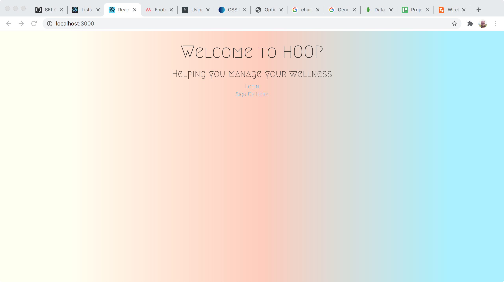

# HOOP

Hoop is a simple app to help you think about taking care of yourself each day.

# Screenshots:

# Technologies Used:

* HTML
* CSS
* Node.js
* Express
* React
* Materialize

# Getting Started:

Heroku => [HOOP](https://calm-journey-92677.herokuapp.com/)

Trello Board => [Trello](https://trello.com/b/aXjPUWvZ/project-4)

ERD => [ERD](https://lucid.app/lucidchart/2b00daa2-256c-4606-aad0-13d88723e3fa/edit?beaconFlowId=F0424CD530C6149C&page=0_0#?folder_id=home&browser=icon

Wireframes => [Wireframes](https://lucid.app/lucidchart/35f19838-1094-44b0-8196-71778cdb2d96/edit?beaconFlowId=98A0D0F88DF3C162&page=0_0#?folder_id=home&browser=icon)

# Next Steps:
Refactor the wellness score metrics.
Write the bar graphs so that the bar graphs exist with very little background.
Make each date or bar in the graph a link to that day's data.